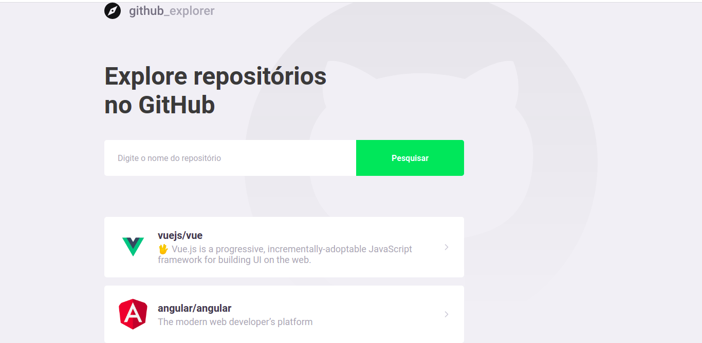

# github-explore
# Descrição do Projeto
<p align="center">Aplicação feita em React que consome a api disponibilizada pelo github.</p>

<h1 align="center">
  
</h1>
### Pré-requisitos

Antes de começar, você vai precisar ter instalado em sua máquina as seguintes ferramentas:
[Git](https://git-scm.com), [Node.js](https://nodejs.org/en/). 
Além disto é bom ter um editor para trabalhar com o código como [VSCode](https://code.visualstudio.com/)

### 🎲 Rodando a aplicação...

```bash
# Clone este repositório
$ git clone <https://github.com/rosana-moreira/github-explore>

# Acesse a pasta do projeto no terminal/cmd
$ cd github-explore

# Instale as dependências
$ yarn

# Execute a aplicação em modo de desenvolvimento
$ yarn start

# O servidor inciará na porta:3000 - acesse <http://localhost:3000>
```
